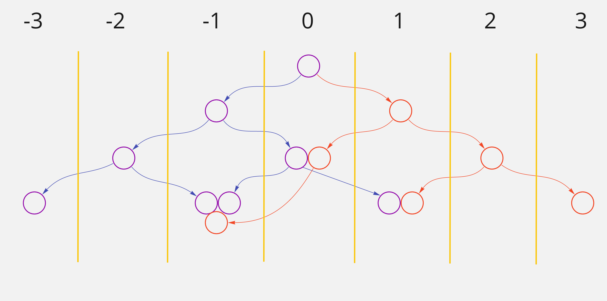

# Binary Tree Algorithm

While working on this algorithm, I decided to try writing some OOP-style code. But I still maintained a functional way of writing, without mutating variables inside class methods.

features:

- the `has()` method checks whether the binary tree contains a value.
- the `getColumn()` method returns only those values that belong to the given column.
- the `traverse()` method returns values based on the selected strategy: DFS (inorder, preorder, postorder) and BFS (breadth-first)

links to articles:
https://blog.bitsrc.io/depth-first-search-of-a-binary-tree-in-javascript-874701d8210a
